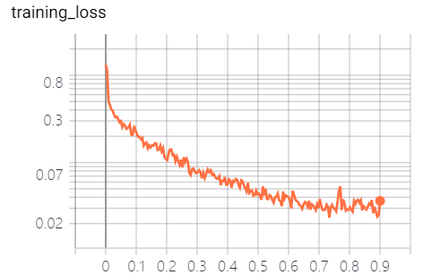
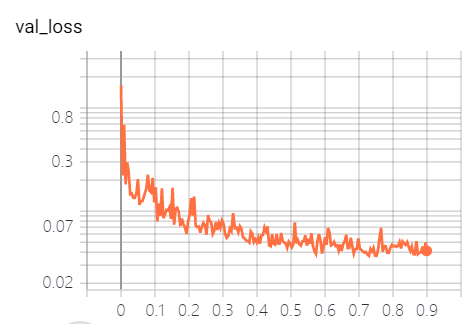
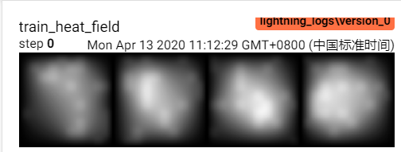
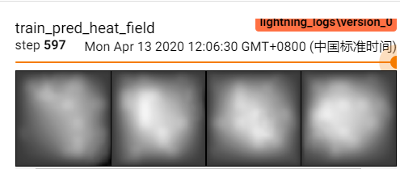
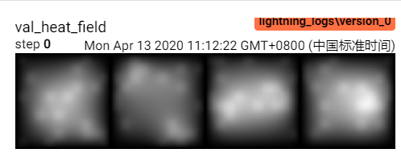
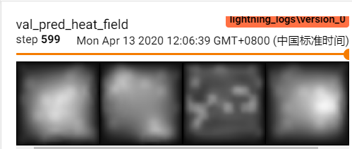

# Example

采用 layout-generator 生成数据集，利用 FPN 模型进行 layout 到 heat_field 的回归

## Usage

- 查看参数帮助 `python train.py -h`
- 使用配置文件 `config.yml` 进行训练。注意参数`data_root` 为数据集目录，需要包含子目录 `train` 与 `test`
  ```bash
  python train.py --config config.yml
  ```
- 训练过程中默认打印模型参数量，采用 `tensorboard` 记录 `hparams`，`train_loss`，`val_loss`，model 的输入与输出图像
- `tensorboard --logdir .` 查看结果

## Result

- 160 train，40 validation

- 参数

| key   | config     | resume_from_checkpoint | seed | gpus | use_16bit | val_check_interval | test_args | data_root        | train_size | drop_prob | input_size | mean_layout | std_layout | mean_heat | std_heat | max_epochs | optimizer_name | lr    | batch_size | num_workers |
| ----- | ---------- | ---------------------- | ---- | ---- | --------- | ------------------ | --------- | ---------------- | ---------- | --------- | ---------- | ----------- | ---------- | --------- | -------- | ---------- | -------------- | ----- | ---------- | ----------- |
| value | config.yml | None                   | 1    | 1    | FALSE     | 1                  | FALSE     | d:/work/dataset1 | 0.8        | 0.2       | 200        | 5000        | 10000      | 298       | 2        | 200        | adam           | 0.001 | 64         | 4           |

- loss




- image





